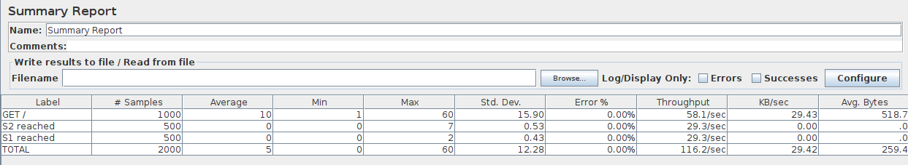
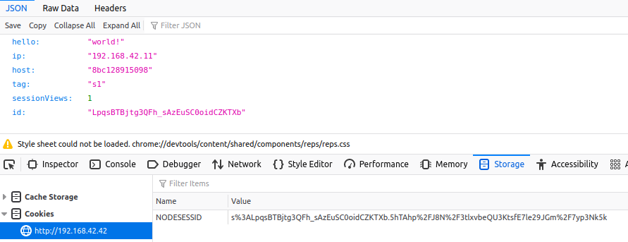
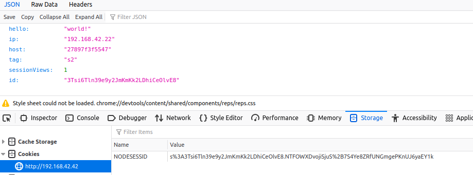
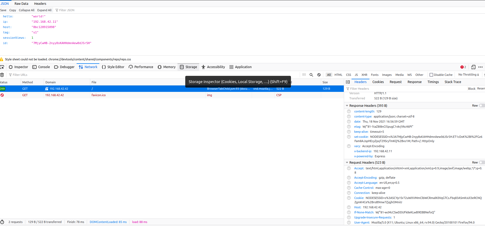

# Laboratoire 3 - Load Balancing

> Auteurs : Lucas Gianinetti, Nicolas Hungerbühler, Cassandre Wojciechowski
>
> Cours : AIT
>
> Date : 18.11.2021

## Introduction

// description globale du labo

## Tâche 1 - Installation des outils

> Les outils `Docker` et `docker-compose` sont déjà installés sur l'ordinateur utilisé pour ce laboratoire. 

Nous avons donc installé `JMeter` avec la commande : 

```bash
$ sudo apt install jmeter 'jmeter-*'
```

Nous avons ensuite lancé la première commande suivante dans le dossier racine du laboratoire, et la seconde pour vérifier que les conteneurs aient été lancés :

```bash
$ docker-compose up --build
$ docker ps
```

Nous constatons que trois conteneurs différents ont été démarrés : `balancing_haproxy`, `balancing_webapp1`, `balancing_webapp2`. 

Nous vérifions que la configuration `bridge` est bien appliquée : 

```bash
$ docker network ls
NETWORK ID     NAME                                                      DRIVER    SCOPE
d2ee042a1ac2   bridge                                                    bridge    local
13cfd9b0b7ae   docker_default                                            bridge    local
544dd0d58670   host                                                      host      local
5f9a574fe881   none                                                      null      local
5e029413fa29   teaching-heigvd-ait-2019-labo-load-balancing_public_net   bridge    local

```

En nous connectant via un browser sur l'adresse http://192.168.42.42:80, nous trouvons un document JSON : 

```json
{
  "hello": "world!",
  "ip": "192.168.42.11",
  "host": "8bc128915098",
  "tag": "s1",
  "sessionViews": 1,
  "id": "RYerKjPmA4IZXgnMCUvgwaiVzfoeqcCq"
}
```

Nous avons lancé le script `tester.jmx` depuis `JMeter` et nous observons le résultat suivant : 



Nous constatons que les requêtes sont bien réparties équitablement entre les deux applications : 500 ont été dirigées sur `s1` et 500 sur `s2`. 


**1.1 Explain how the load balancer behaves when you open and refresh the URL http://192.168.42.42 in your browser. Add screenshots to complement your explanations. We expect that you take a deeper a look at session management.**

La première requête que nous faisons nous fait apparaître le tag `s1` avec un id commençant par `Lpqs `.



La seconde fait apparaître le tag `s2` et un id commençant `3Tsi`. 



Une requête sur deux aura le tag `s1` et l'autre aura donc le tag `s2`, nous pouvons donc déduire le load balancer alterne les redirections sur les deux web app. 

Par contre, les identifiants changent à chaque rafraichissement de page, donc nous changeons de session à chaque fois. Cela explique que le champ `sessionViews` reste toujours à 1. 


**1.2 Explain what should be the correct behavior of the load balancer for session management.**

Le comportement qui semble logique serait qu'une session reste active tant que l'utilisateur n'a pas quitté l'application web. Cela permettrait d'incrémenter correctement le compteur de requêtes envoyées. 

Par contre, il faut noter que l'utilisateur d'une session doit toujours être redirigé sur le même serveur. 


**1.3 Provide a sequence diagram to explain what is happening when one requests the URL for the first time and then refreshes the page. We want to see what is happening with the cookie. We want to see the sequence of messages exchanged (1) between the browser and HAProxy and (2) between HAProxy and the nodes S1 and S2.**



cookies envoyés - reçus d'une fois a l'autre à checker pour le diagramme !!!!


```sequence
```


## Tâche 2 - La persistence des sessions (sticky sessions)

## Tâche 3 - Le drainage des connexions (drain mode)

## Tâche 4 - Le mode dégradé avec Round Robin

## Tâche 5 - Les stratégies de load balancing

## Conclusion 

// ce que ce labo vous a apporté, ce que vous en retenez