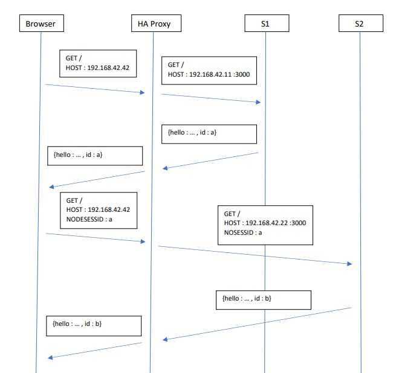

# Laboratoire 3 - Load Balancing

> Auteurs : Lucas Gianinetti, Nicolas Hungerbühler, Cassandre Wojciechowski
>
> Cours : AIT
>
> Date : 18.11.2021

## Introduction

// description globale du labo

## Tâche 1 - Installation des outils

> Les outils `Docker` et `docker-compose` sont déjà installés sur l'ordinateur utilisé pour ce laboratoire. 

Nous avons donc installé `JMeter` avec la commande : 

```bash
$ sudo apt install jmeter 'jmeter-*'
```

Nous avons ensuite lancé la première commande suivante dans le dossier racine du laboratoire, et la seconde pour vérifier que les conteneurs aient été lancés :

```bash
$ docker-compose up --build
$ docker ps
```

Nous constatons que trois conteneurs différents ont été démarrés : `balancing_haproxy`, `balancing_webapp1`, `balancing_webapp2`. 

Nous vérifions que la configuration `bridge` est bien appliquée : 

```bash
$ docker network ls
NETWORK ID     NAME                                                      DRIVER    SCOPE
d2ee042a1ac2   bridge                                                    bridge    local
13cfd9b0b7ae   docker_default                                            bridge    local
544dd0d58670   host                                                      host      local
5f9a574fe881   none                                                      null      local
5e029413fa29   teaching-heigvd-ait-2019-labo-load-balancing_public_net   bridge    local

```

En nous connectant via un browser sur l'adresse http://192.168.42.42:80, nous trouvons un document JSON : 

```json
{
  "hello": "world!",
  "ip": "192.168.42.11",
  "host": "8bc128915098",
  "tag": "s1",
  "sessionViews": 1,
  "id": "RYerKjPmA4IZXgnMCUvgwaiVzfoeqcCq"
}
```

Nous avons lancé le script `tester.jmx` depuis `JMeter` et nous observons le résultat suivant : 


Nous constatons que les requêtes sont bien réparties équitablement entre les deux applications : 500 ont été dirigées sur `s1` et 500 sur `s2`. 


**1.1 Explain how the load balancer behaves when you open and refresh the URL http://192.168.42.42 in your browser. Add screenshots to complement your explanations. We expect that you take a deeper a look at session management.**

La première requête que nous faisons nous fait apparaître le tag `s1` avec un id commençant par `Lpqs `.


La seconde fait apparaître le tag `s2` et un id commençant `3Tsi`. 


Une requête sur deux aura le tag `s1` et l'autre aura donc le tag `s2`, nous pouvons donc déduire le load balancer alterne les redirections sur les deux web app. 

Par contre, les identifiants changent à chaque rafraichissement de page, donc nous changeons de session à chaque fois. Cela explique que le champ `sessionViews` reste toujours à 1. 


**1.2 Explain what should be the correct behavior of the load balancer for session management.**

Le comportement qui semble logique serait qu'une session reste active tant que l'utilisateur n'a pas quitté l'application web. Cela permettrait d'incrémenter correctement le compteur de requêtes envoyées. 

Par contre, il faut noter que l'utilisateur d'une session doit toujours être redirigé sur le même serveur. 


**1.3 Provide a sequence diagram to explain what is happening when one requests the URL for the first time and then refreshes the page. We want to see what is happening with the cookie. We want to see the sequence of messages exchanged (1) between the browser and HAProxy and (2) between HAProxy and the nodes S1 and S2.**


Lors de la première requête, la webapp 1 attribue un cookie à l'utilisateur. Lors de la seconde requête, ce premier cookie est envoyé à la webapp 2. Celle-ci ne le reconnait pas et en attribue donc un nouveau à l'utilisateur. 

Le cookie est donc changé à chaque fois, car les webapps ne reconnaissent pas les cookies attribués par l'autre. 




**1.4 Provide a screenshot of the summary report from JMeter**

 


**1.5 Stop the containers and re-run the test plan in JMeter. Explain what is happening when only one node remains active. Provide another sequence diagram using the same model as the previous one.**

Nous arrêtons le conteneur s1 avec la commande :

```bash
$ docker stop s1
```

Après son arrêt, nous relançons JMeter et nous obtenons le rapport suivant :


Sur la capture ci-dessus, nous constatons que toutes les requêtes sont donc effectuées sur la webapp s2. Selon les tests manuels que nous avons pu faire, le compteur est bien incrémenté à chaque requête et le cookie utilisé reste systématiquement le même. 

Le diagramme de séquence réalisé suite à cette tentative est le suivant : 


La webapp reconnait systématiquement le cookie qui est envoyé car c'est elle qui l'a attributé à la base. Il n'est jamais changé par une autre webapp et permet donc d'incrémenter le compteur `sessionViews`. 


## Tâche 2 - La persistence des sessions (sticky sessions)

**2.1 There is different way to implement the sticky session. One possibility is to use the SERVERID provided by HAProxy. Another way is  to use the NODESESSID provided by the application. Briefly explain the difference between both approaches (provide a sequence diagram with cookies to show the difference).**

Avec la methode SERVERID, le load balancer va séparer le cookie avec une partie SERVERID qui est collée au serveur correspondant. On peut ensuite récupérer le bon cookie pour récupérer la bonne session :

```sequence
Browser->HaProxy: GET / \n HOST:192.168.42.42
HaProxy->S1: GET / \n HOST:192.168.42.11
S1->HaProxy: {hello:..., sessionViews:1, id: a}
HaProxy->Browser: {hello,..., sessionViews:1, id: a} \n SERVERID=s1 
Browser->HaProxy: GET / \n HOST:192.168.42.42 \n SERVERID=s1 NODESESSID=a
HaProxy->S1: GET / \n HOST:192.168.42.11 \n NODESESSID=a
S1->HaProxy: {hello:..., sessionViews:2, id:a}
HaProxy->Browser: {hello:..., sessionViews:2, id:a} \n SERVERID=s1 NODESESSID=a
```

Dans la deuxième methode, on va insérer le SERVERID directement dans le cookie NODESESSID. Il est séparer par un ~. Comme pour la methode précédente, pour le serveur il n'y a auune différence. C'est uniquement le load balancer qui gère de mettre le SERVERID dans le NODESESSID. 

```sequence
Browser->HaProxy: GET / \n HOST:192.168.42.42
HaProxy->S1: GET / \n HOST:192.168.42.11
S1->HaProxy: {hello:..., sessionViews:1, id: a}
HaProxy->Browser: {hello,..., sessionViews:1, id: a} \n NODESESSID=s1~a
Browser->HaProxy: GET / \n HOST:192.168.42.42 \n NODESESSID=s1~a
HaProxy->S1: GET / \n HOST:192.168.42.11 \n NODESESSID=a
S1->HaProxy: {hello:..., sessionViews:2, id:a} \n NODESESSID=a
HaProxy->Browser: {hello:..., sessionViews:2, id:a} \n NODESESSID=s1~a
```

**2.2 Provide the modified `haproxy.cfg` file with a short explanation of the modifications you did to enable sticky session management.**

> Source : https://www.haproxy.com/fr/blog/load-balancing-affinity-persistence-sticky-sessions-what-you-need-to-know/

    backend nodes
    
    ...
    
    cookie SERVERID insert indirect nocache
    
    # Define the list of nodes to be in the balancing mechanism
    # http://cbonte.github.io/haproxy-dconv/2.2/configuration.html#4-server
    server s1 ${WEBAPP_1_IP}:3000 check cookie s1
    server s2 ${WEBAPP_2_IP}:3000 check cookie s2

* `cookie SERVERID insert indirect nocache`
  * Indique à HAProxy qu'il faut configurer un cookie SERVERID uniquement si l'utilisateur n'en a pas fourni un avec sa requête.
* `check cookie s1` et `check cookie s2`
  * Indique à HAProxy sur quel serveur rediriger l'utilisateur en fonction de son cookie.

**2.3 Explain what is the behavior when you open and refresh the URL http://192.168.42.42 in your browser. Add screenshots to complement your explanations. We expect that you take a deeper a look at session management.**

L'utilisateur est toujours redirigé vers la même webapp, une même session est utilisée pour toutes les requêtes de l'utilisateur.


On peut voir ci-dessus que la session est bien identique pour les différentes requêtes d'un utilisateur. On voit aussi que le cookie SERVERID est bien présent afin d'indiquer au load balancer ou rediriger la requête (dans ce cas sur la webapp1).

**2.4 Provide a sequence diagram to explain what is happening when one requests the URL for the first time and then refreshes the page. We want to see what is happening with the cookie. We want to see the sequence of messages exchanged (1) between the browser and HAProxy and (2) between HAProxy and the nodes S1 and S2. We also want to see what is happening when a second browser is used.**

```sequence
participant Browser1
participant Browser2
participant HaProxy
participant S1
participant S2
Browser1->HaProxy: GET / \n HOST:192.168.42.42
HaProxy->S1: GET / \n HOST:192.168.42.11
S1->HaProxy: {hello:..., sessionViews:1, id: a}
HaProxy->Browser1: {hello,..., sessionViews:1, id: a} \n SERVERID=s1 
Browser1->HaProxy: GET / \n HOST:192.168.42.42 \n SERVERID=s1 NODESESSID=a
HaProxy->S1: GET / \n HOST:192.168.42.11 \n NODESESSID=a
S1->HaProxy: {hello:..., sessionViews:2, id:a}
HaProxy->Browser1: {hello:..., sessionViews:2, id:a} \n SERVERID=s1 NODESESSID=a

Browser2->HaProxy: GET / \n HOST:192.168.42.42
HaProxy->S2: GET / \n HOST:192.168.42.12
S2->HaProxy: {hello:..., sessionViews:1, id: b}
HaProxy->Browser2: {hello,..., sessionViews:1, id: b} \n SERVERID=s2 
Browser2->HaProxy: GET / \n HOST:192.168.42.42 \n SERVERID=s2 NODESESSID=b
HaProxy->S2: GET / \n HOST:192.168.42.22 \n NODESESSID=b
S2->HaProxy: {hello:..., sessionViews:2, id:b}
HaProxy->Browser2: {hello:..., sessionViews:2, id:b} \n SERVERID=s2 NODESESSID=b
```

**2.5 Provide a screenshot of JMeter's summary report. Is there a difference with this run and the run of Task 1?**


Nous observons que toutes les requêtes ont été redirigées vers la même webapp et donc que le sticky session est implémenté correctement. C'est différement du cas de la task1 ou l'on était redirigé de manière uniforme sur les deux webapps.

- **Clear the results in JMeter.**
- **Now, update the JMeter script. Go in the HTTP Cookie Manager and ~~uncheck~~verify that the box `Clear cookies each iteration?` is unchecked.**
- **Go in `Thread Group` and update the `Number of threads`. Set the value to 2.**

  

**2.6 Provide a screenshot of JMeter's summary report. Give a short explanation of what the load balancer is doing.**


Nous avons configuré JMeter pour simuler l'envoi par deux utilisateurs de 1000 requêtes chacun. De plus les cookies ne sont pas reset à chaque nouvelle requête.

Nous observons le résultat attendu:
* Lors de sa première requête un des deux utililisateurs a été redirigé vers la webapp1. Lors des 999 requêtes suivantes il a été redirigé vers la même webapp.
* Pour l'autre utilisateur, le scénario est identique mais avec la webapp2.


## Tâche 3 - Le drainage des connexions (drain mode)

**3.1 Take a screenshot of the Step 5 and tell us which node is answering.**


Sur la capture ci-dessus, nous constatons que la node qui a été atteinte est la node `s2`. 

**3.2 Based on your previous answer, set the node in DRAIN mode. Take a screenshot of the HAProxy state page.**

Après avoir entré les commandes suivantes, nous avons repris une capture d'écran de la page de statistiques HAProxy : 

```bash
$ socat - tcp:192.168.42.42:9999
prompt
> set timeout cli 1d
> set server nodes/s2 state drain
```

Nous obtenons une page de statistiques actualisée : 


Nous constatons que la couleur de la ligne concernant la node `s2` a changé. La colonne `STATUS` indique également que le mode `DRAIN` est activé depuis 30 secondes. 

**3.3 Refresh your browser and explain what is happening. Tell us if you stay on the same node or not. If yes, why? If no, why?**

En rafraichissant la fenêtre du navigateur ouverte et connectée sur la node `s2`, nous constatons que le compteur continue d'être incrémenté : 


Le mode `DRAIN` permet de retirer le serveur du load balancing, mais les connexions qui sont déjà établies restent en place. 

**3.4 Open another browser and open `http://192.168.42.42`. What is happening?**

Lorsque nous ouvrons un nouveau navigateur pour nous rendre sur l'adresse mentionnée, nous tombons sur la node `s1`: 


Sur la capture d'écran ci-dessus, nous voyons la fenêtre de gauche connectée sur la node `s2` (la première fenêtre qui a été ouverte avant le mode `DRAIN`) et la fenêtre de droite qui est le nouveau navigateur connecté sur la node `s1`. Lorsque nous rafraichissons cette fenêtre, nous restons toujours sur la même node.  

**3.5 Clear the cookies on the new browser and repeat these two steps multiple times. What is happening? Are you reaching the node in DRAIN mode?**

Non, nous n'atteignons jamais la node `s2` qui est la node en mode `DRAIN` malgré avoir rafraichit la page et supprimé les cookies plusieurs fois. Nous restons sur la node `s1`. C'est exactement ce qui est supposé se passer, car c'est le rôle du mode `DRAIN` de ne pas accepter de nouvelles connexions mais de garder actives celles qui sont déjà établies. 

**3.6 Reset the node in READY mode. Repeat the three previous steps and explain what is happening. Provide a screenshot of HAProxy's stats page.**

Nous avons entré la commande suivante afin de remettre la node `s2` en état `READY`: 

```bash
> set server nodes/s2 state ready
```

Nous rafraichissons la page de statistiques de HAProxy pour que la modification soit prise en compte et nous obtenons la capture d'écran suivante :


Nous constatons que l'état a bien été modifié car la colonne `STATUS` indique de nouveau un état `UP`. En rafraichissant la page de navigateur déjà connectée sur la node `s2`, nous voyons qu'elle reste sur la même node : 


En ouvrant une nouvelle fenêtre de navigation, nous allons sur l'adresse `http://192.168.42.42/` et nous constatons que nous nous retrouvons sur la node `s2` mais que le compteur est de nouveau à 1. Nous en déduisons donc qu'une nouvelle session a été ouverte pour ce nouveau navigateur : 


Le fonctionnement normal est donc retrouvé, il est de nouveau possible de se connecter sur la node `s2` avec une nouvelle session. 

**3.7 Finally, set the node in MAINT mode. Redo the three same steps and explain what is happening. Provide a screenshot of HAProxy's stats page.**

Nous modifions le mode avec la commande : 

```bash
> set server nodes/s2 state maint
```

La page de statistiques de HAProxy a maintenant un affichage différent : 


Nous constatons que la couleur de la ligne de la node `s2` a changé, et la colonne `STATUS` indique que cette node est en mode `MAINT`.

Lorsque nous rafraichissons la page déjà connectée sur la node `s2`, nous atteignons la node `s1` avec un compteur avec une valeur de 1, donc une nouvelle session : 


Puis, nous ouvrons une nouvelle page et nous atteignons également la node `s1`, car la node `s2` est en état de maintenance (`MAINT`) et elle n'accepte plus aucune connexion (celles déjà établies sont arrêtées) :


## Tâche 4 - Le mode dégradé avec Round Robin

**4.1 Make sure a delay of 0 milliseconds is set on `s1`. Do a run to have a baseline to compare with in the next experiments.**


**4.2 Set a delay of 250 milliseconds on `s1`. Relaunch a run with the JMeter script and explain what is happening.**


Nous pouvons observer que le rendement de s1 a grandement diminué et est passé à 3.3 requêtes par secondes.

**4.3 Set a delay of 2500 milliseconds on `s1`. Same than previous step.**


Nous observons que s1 ne reçoit plus aucune requête et que toutes les requêtes sont redirigées vers s2. (Explications dans le point suivant)

**4.4 In the two previous steps, are there any errors? Why?**

On ne voit pas d'erreur directement dans JMeter, mais si on regarde dans les outputs de docker-compose on peut voir un message d'erreur nous indiquant qu'il considère s1 comme étant down. Cela s'explique par le fait que la durée de vérification (2001ms) est plus courte que la durée du délai que nous avons configuré. Par ce fait toutes les requêtes sont redirigées sur s2.

Voici l'erreur retournée : `[WARNING] 340/142844 (10) : Server nodes/s1 is DOWN, reason: Layer7 timeout, check duration: 2001ms. 1 active and 0 backup servers left. 1 sessions active, 0 requeued, 0 remaining in queue.`

**4.5 Update the HAProxy configuration to add a weight to your nodes. For that, add `weight [1-256]` where the value of weight is between the two values (inclusive). Set `s1` to 2 and `s2` to 1. Redo a run with a 250ms delay.**

```
backend nodes
[...]
server s1 ${WEBAPP_1_IP}:3000 check cookie s1 weight 2
server s2 ${WEBAPP_2_IP}:3000 check cookie s2 weight 1
```


Comme il n'y a que deux threads et qu'il y a une schedulin policy Round robin, un utilisateur sera envoyé sur chaque serveur et dans ce cas là nous n'observons pas l'impact du poids.

**4.6 Now, what happens when the cookies are cleared between  each request and the delay is set to 250ms? We expect just one or two  sentence to summarize your observations of the behavior with/without  cookies.**


Comme les cookies sont effacés entre chaque requête, chaque requête est considérée comme venant d'un nouvel utilisateur. Dans ce cas là, nous pouvons observer l'impact du poids des serveurs. Nous observons donc que dans 2/3 des cas les requêtes sont redirigées vers s1 et dans le tier restant vers s2.

## Tâche 5 - Les stratégies de load balancing

> Source utilisée : http://cbonte.github.io/haproxy-dconv/2.2/configuration.html
>
> La documentation fournie dans la donnée était dépréciée, d'où notre choix d'utiliser une autre source.

**5.1 Briefly explain the strategies you have chosen and why you have chosen them.**

```
  first       The first server with available connection slots receives the
              connection. The servers are chosen from the lowest numeric
              identifier to the highest (see server parameter "id"), which
              defaults to the server's position in the farm. Once a server
              reaches its maxconn value, the next server is used. It does
              not make sense to use this algorithm without setting maxconn.
              The purpose of this algorithm is to always use the smallest
              number of servers so that extra servers can be powered off
              during non-intensive hours. This algorithm ignores the server
              weight, and brings more benefit to long session such as RDP
              or IMAP than HTTP, though it can be useful there too. In
              order to use this algorithm efficiently, it is recommended
              that a cloud controller regularly checks server usage to turn
              them off when unused, and regularly checks backend queue to
              turn new servers on when the queue inflates. Alternatively,
              using "http-check send-state" may inform servers on the load.
              
  random
  random(<draws>)
              A random number will be used as the key for the consistent
              hashing function. This means that the servers' weights are
              respected, dynamic weight changes immediately take effect, as
              well as new server additions. Random load balancing can be
              useful with large farms or when servers are frequently added
              or removed as it may avoid the hammering effect that could
              result from roundrobin or leastconn in this situation. The
              hash-balance-factor directive can be used to further improve
              fairness of the load balancing, especially in situations
              where servers show highly variable response times. When an
              argument <draws> is present, it must be an integer value one
              or greater, indicating the number of draws before selecting
              the least loaded of these servers. It was indeed demonstrated
              that picking the least loaded of two servers is enough to
              significantly improve the fairness of the algorithm, by
              always avoiding to pick the most loaded server within a farm
              and getting rid of any bias that could be induced by the
              unfair distribution of the consistent list. Higher values N
              will take away N-1 of the highest loaded servers at the
              expense of performance. With very high values, the algorithm
              will converge towards the leastconn's result but much slower.
              The default value is 2, which generally shows very good
              distribution and performance. This algorithm is also known as
              the Power of Two Random Choices and is described here :
              http://www.eecs.harvard.edu/~michaelm/postscripts/handbook2001.pdf
```

**5.2 Provide evidence that you have played with the two strategies (configuration done, screenshots)**

**5.2.1 `leastconn`**

Nous avons modifié la configuration comme suit : 

```
backend nodes
[...]
    balance leastconn
[...]
	server s1 ${WEBAPP_1_IP}:3000 cookie S1 check
    server s2 ${WEBAPP_2_IP}:3000 cookie S2 check
```

Nous avons essayé en ajoutant un delay de 250 ms sur la node `s1` grâce à la commande : 

```bash
$ curl -H "Content-Type: application/json" -X POST -d '{"delay": 250}' http://192.168.42.11:3000/delay
```

Nous avons lancé le script `tester.jmx` sur JMeter avec deux threads et 500 requêtes par thread, pour obtenir le résultat suivant : 


Nous constatons que la node `s1` a reçu moins de requêtes (172), car elle mettait plus de temps à répondre. Le load balancer répartit alors les requêtes sur la node `s2` qui est disponible. 

Avec un delay de 500 ms, nous avons obtenu le résultat suivant : 


Seules 64 requêtes ont été dirigées vers la node `s1`. 

Nous avons ensuite essayé d'ajouter un delay plus grand, c'est-à-dire 1000 ms : 


Lorsque nous augmentons le delay en le doublant, nous constatons que la node `s1` reçoit quasiment deux fois moins de requêtes, car elle est deux fois plus lente à répondre. Avec un delay de 1000 ms, elle reçoit 36 requêtes, soit deux fois moins qu'avec un delay de 500 ms (64 reçues). 

**5.2.2 `random`**

Nous avons modifié la configuration comme suit : 

```
backend nodes
[...]
	balance random
[...]
    server s1 ${WEBAPP_1_IP}:3000 check
    server s2 ${WEBAPP_2_IP}:3000 check
```

Nous avons fait plusieurs essais avec JMeter pour tester si les nodes sont réellement atteintes de manière aléatoire, et nous concluons que c'est le cas, car chacun de nos essais donne un résultat différent : 

|   |
| --------------------------------- |
|   |
|  |

**5.3 Compare the two strategies and conclude which is the best for this lab (not necessary the best at all).**

// TODO


## Conclusion 

// ce que ce labo vous a apporté, ce que vous en retenez